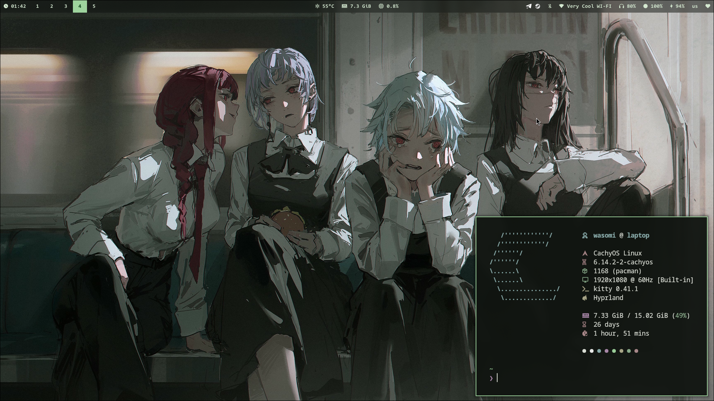
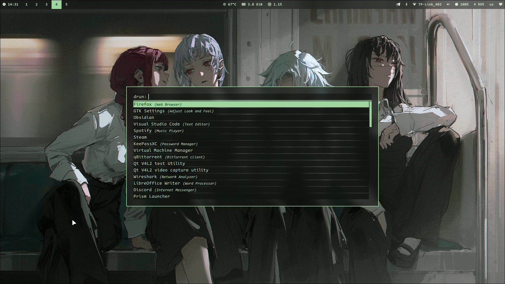
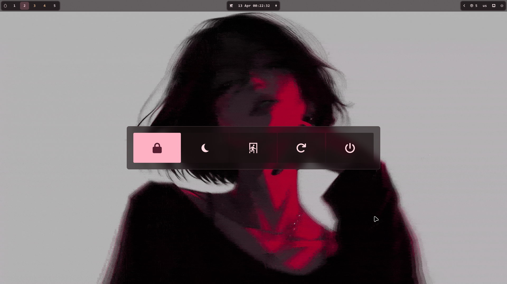
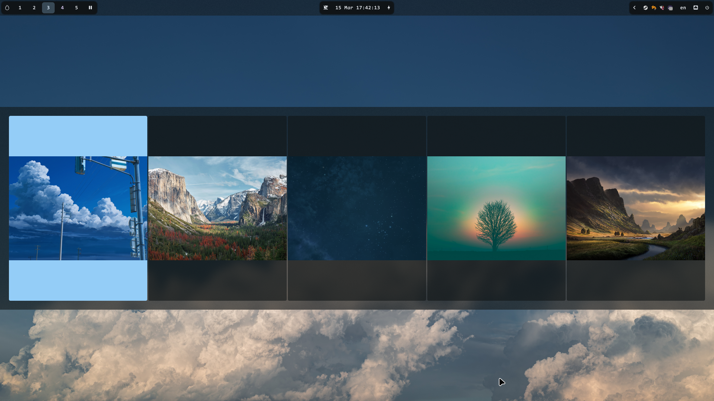

> [!warning]
> work in progress
> 
> i made this dotfiles for my device, if you have problems i will try to help you

## about

- os: `cachyos`
- wm: `hyprland`
- bar: `waybar`
- terminal: `kitty`
- shell: `fish`
- app launcher: `rofi`
- notify-daemon: `swaync`
- wallpaper-daemon: `swww`

## gallery

> [!warning]
> the gallery may be outdated and look differently

## install

1. `git clone https://github.com/wasomi/dotfiles ~/.dotfiles`
2. `pacman -S - < pkgList`
3. `paru -S - < aurPkgList`
4. `ln -s` for all folders in .dotfiles/.config
    
    example: `ln -s ~/.dotfiles/.config/hyprland/ ~/.config/`
5. `ln -s ~/.dotfiles/.local/bin/ ~/.local/`
6. `ln -s ~/.dotfiles/Pictures/Wallpapers/ ~/Pictures/`
7. reboot your device
8. start hyprland <3

## optional pkgs

> i'm just using these packages

- `pacman -S - < optionalPkgList`

- `paru -S - < optionalAurPkgList`

## todo

- [ ] satty
- [ ] hotkeys list in readme.md / rofi hotkey list
- [ ] microphone module for waybar

## thanks to

- [zproger](https://github.com/Zproger/) for the [rofi scripts](https://github.com/Zproger/bspwm-dotfiles/tree/main/bin)
- [sane1090](https://www.youtube.com/@sane1090x) for the [theme switcher script](https://youtu.be/PLb2lA9jBCI?si=PrIcooBkzP5Gz0YF)
- [wallhaven](https://wallhaven.cc) for the wallpapers
- [mylinuxtowork](https://github.com/mylinuxforwork) for the [hyprland animations](https://github.com/mylinuxforwork/dotfiles/tree/main/share/dotfiles/.config/hypr/conf/animations)
- [dylanaraps](https://github.com/dylanaraps) for the [rofi theme](https://github.com/dylanaraps/pywal/blob/master/pywal/templates/colors-rofi-dark.rasi)
- ai bots for providing useful examples