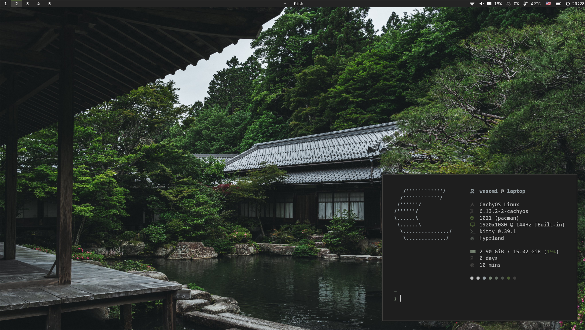

## about

i made these dotfiles for myself...

- os: `cachyos`
- wm: `hyprland`
- bar: `waybar`
- terminal: `kitty`
- shell: `fish`
- app launcher: `rofi`
- notify-daemon: `swaync`

## gallery:



## required pkgs:

```
pacman -S hyprland hyprpaper hyprlock hypridle kitty waybar rofi-wayland nwg-look adw-gtk-theme network-manager-applet swaync
```

```
paru -S python-pywal16 waypaper hyprshot
```

## optional pkgs:

```
sudo pacman -S telegram-desktop obsidian keepassxc libreoffice-fresh qbittorrent syncthing tailscale virt-manager qemu-desktop
```

```
paru -S visual-studio-code-bin
```

## install:

i will do it tomorrow, maybe...

## todo:

- [x] waybar
- [x] rofi
- [ ] hyprland separeted configs
- [x] hyprlock
- [x] hypridle
- [x] power menu
- [x] screenshot
- [x] icons
- [x] fastfetch
- [ ] clipboard history
- [ ] emoji menu
